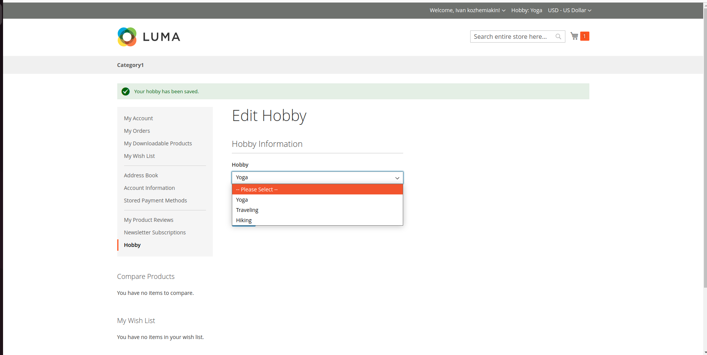
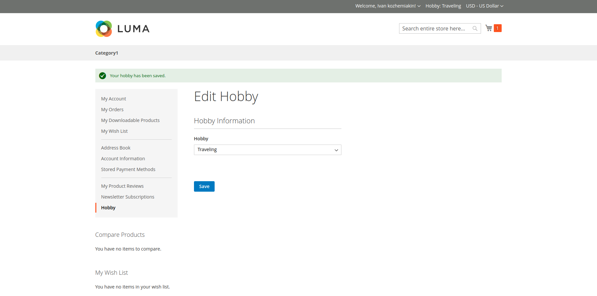
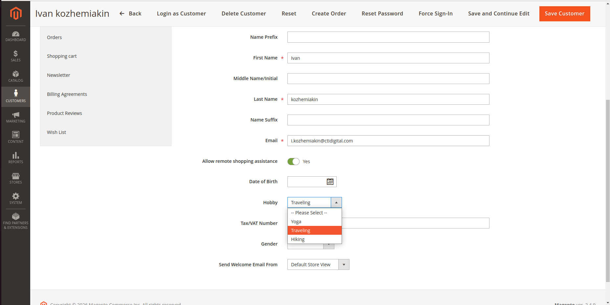

# Kozhemiakin_CustomerHobby

Magento 2 module that adds a custom customer attribute **Hobby** (`select`: Yoga, Traveling, Hiking) with Admin Panel, Customer Account, Header, and GraphQL support.

## Requirements

- Magento 2.4.9
- PHP 8.3
- MySQL 8.0

## Installation

```bash
bin/magento module:enable Kozhemiakin_CustomerHobby
bin/magento setup:upgrade
bin/magento setup:di:compile
bin/magento cache:flush
```

## Features

- **Customer Attribute:** `hobby` (select) with options: `Yoga` (1), `Traveling` (2), `Hiking` (3).
- **Admin Panel:** Editable in **Customers → All Customers → Edit Customer → Account Information** and visible in the Customer Grid.
- **Customer Account:** Dedicated **Hobby** tab with edit form (`hobby/index/edit`).
- **Header Display:** Renders `Hobby: %s` in the header via **Private Content**(`customerData` / Knockout.js) works with **FPC**.
- **Code Quality:** All code was verified and passed PHP CodeSniffer checks (`phpcs --standard=Magento2`).

## Screenshots

### Frontend (Customer Account & Header)





### Admin Panel


## GraphQL

### Query

A custom resolver (`Model/Resolver/CustomerHobby.php`) provides direct access to the selected option label:

```graphql
query {
  customer {
    firstname
    email
    hobby
  }
}
```

```json
{
  "data": {
    "customer": {
      "firstname": "Ivan",
      "email": "customer@example.com",
      "hobby": "Yoga"
    }
  }
}
```

### Mutation (Updating Hobby)

No custom mutation resolver is required. Because the attribute is registered for `customer_account_edit` in `used_in_forms`, Magento's core `updateCustomerV2` mutation natively supports updating it via `custom_attributes`:

```graphql
mutation {
  updateCustomerV2(
    input: {
      custom_attributes: [
        { attribute_code: "hobby", value: "2" }
      ]
    }
  ) {
    customer {
      hobby
    }
  }
}
```


```json
{
    "data": {
        "updateCustomerV2": {
            "customer": {
                "hobby": "Traveling"
            }
        }
    }
}
```

Option IDs:
- `1` — Yoga
- `2` — Traveling
- `3` — Hiking
- `""` — Clear attribute
